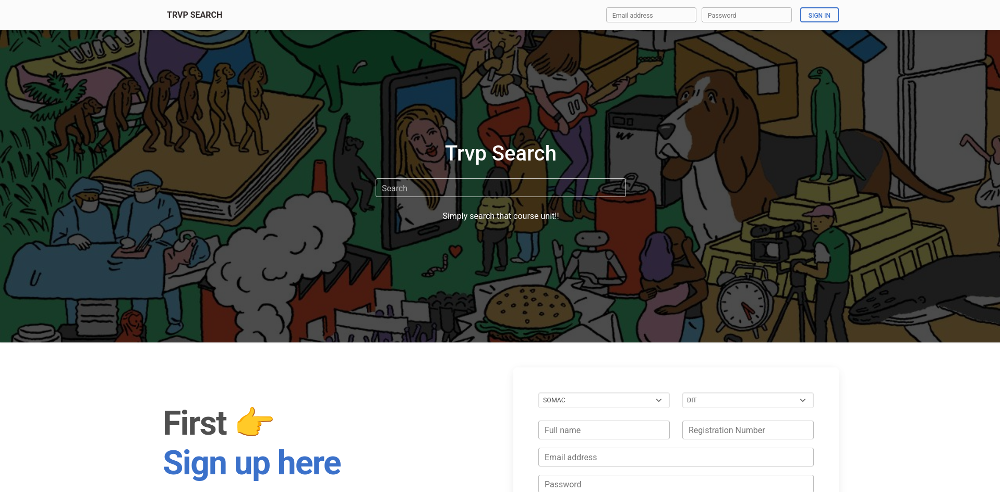

# 🎓 TRVP Search

> **Your Ultimate Course Discovery & Results Management System**



[](https://php.net)
[](https://mysql.com)
[](LICENSE)
[](https://getbootstrap.com)

## 📖 Overview

TRVP Search is a powerful web application designed to help students effortlessly search and discover courses, view their academic results, and manage their educational journey. Built with modern web technologies and a focus on user experience.

## ✨ Features

### 🔍 **Smart Course Search**
- Real-time search functionality
- Filter by programme (DIT, BIT, DCS, BCS, DIC, BIC, DSTAT, BSTAT)
- View course details including lecturer info
- See your grades and status for enrolled courses

### 👤 **User Authentication**
- Secure signup with email verification
- Password hashing using BCrypt
- Session management
- Protected routes for authenticated users

### 📊 **Results Dashboard**
- View all your course results in one place
- Statistics cards showing:
  - Total courses
  - Passed courses
  - Courses to redo
  - Pending results (TBD)
- Color-coded status badges
- Print-friendly results page

### 🎨 **Modern UI/UX**
- Responsive design (mobile, tablet, desktop)
- Material Design Bootstrap (MDB) components
- Smooth animations and transitions
- Intuitive navigation

## 🚀 Installation

### Prerequisites

- PHP 7.4 or higher
- MySQL 8.0 or higher
- Apache/Nginx web server
- Composer (optional, for dependencies)

### Step 1: Clone the Repository

```bash
git clone https://github.com/yourusername/trvpsearch.git
cd trvpsearch
```

### Step 2: Database Setup

1. Create a new MySQL database:
```sql
CREATE DATABASE trvpsearch;
```

2. Import the database schema:
```bash
mysql -u root -p trvpsearch < database/schema.sql
```

3. Update database credentials in `includes/db_connect.php`:
```php
define('DB_SERVER', 'localhost');
define('DB_USERNAME', 'root');
define('DB_PASSWORD', 'your_password');
define('DB_NAME', 'trvpsearch');
```

### Step 3: Configure Web Server

#### For XAMPP/LAMPP:
1. Copy project to `htdocs` folder
2. Start Apache and MySQL
3. Access via `http://localhost/trvpsearch`

#### For Production:
1. Point document root to project directory
2. Ensure PHP extensions are enabled: PDO, PDO_MySQL
3. Set proper file permissions

### Step 4: Initialize Application

1. Visit the application in your browser
2. Create your first account
3. Start searching for courses!

## 📁 Project Structure

```
trvpsearch/
├── includes/
│   ├── db_connect.php     # Database connection
│   ├── session.php        # Session management
│   ├── functions.php      # Helper functions
│   ├── auth.php          # Authentication (signup/signin)
│   ├── search.php        # Search functionality
│   └── logout.php        # Logout handler
├── classes/
│   └── user.php          # Trvpsearch class with all methods
├── css/
│   └── mdb.min.css       # Material Design Bootstrap
├── js/
│   ├── script.js         # Main JavaScript file
│   └── mdb.umd.min.js    # MDB JavaScript
├── images/
│   ├── trvpbg.jpeg       # Background image
│   └── avatar.jpg        # Default avatar
├── index.php             # Landing page
├── results.php           # Student results page
└── README.md            # This file
```

## 🔧 Configuration

### Database Tables

**students**
- studentId (Primary Key)
- school (SOMAC, SONAS, ECONOMICS)
- programme (DIT, BIT, DCS, BCS, DIC, BIC, DSTAT, BSTAT)
- fullname
- regNo (Format: YYYY-YY-XXXXX)
- email
- password (BCrypt hashed)
- activation (Yes/No)
- avatar
- timestamps

**courses**
- course_id (Primary Key)
- course_code
- course_title
- year
- semester
- l_code (Foreign Key to lecturers)
- dit, bit, dcs, bcs, dic, bic, dstat, bstat (Yes/No flags)

**lecturers**
- l_id (Primary Key)
- l_code
- l_name
- mobile
- l_avatar

**course_results**
- result_id (Primary Key)
- regNo (Foreign Key to students)
- course_code (Foreign Key to courses)
- grade
- status (Passed, Redo, TBD)

## 🎯 Usage

### For Students

1. **Sign Up**
   - Select your school and programme
   - Enter your full name and registration number
   - Provide email and create password
   - Check "I am a KIU student" checkbox

2. **Search Courses**
   - Use the search bar on homepage
   - Type course name or programme code
   - View results instantly
   - See your grades if logged in

3. **View Results**
   - Click on your profile dropdown
   - Navigate to "My Results"
   - View all your course results
   - Print results if needed

### For Administrators

1. Manage student accounts via database
2. Add/update course information
3. Input student results
4. Manage lecturer information

## 🔐 Security Features

- ✅ Password hashing with BCrypt (cost: 12)
- ✅ PDO prepared statements (SQL injection protection)
- ✅ XSS protection with `htmlspecialchars()`
- ✅ CSRF protection via session validation
- ✅ Secure session management
- ✅ Input validation on client and server side

## 🛠️ Technologies Used

- **Backend:** PHP 7.4+
- **Database:** MySQL 8.0+
- **Frontend:** HTML5, CSS3, JavaScript
- **Framework:** Material Design Bootstrap 5
- **Library:** jQuery 3.6.0
- **Icons:** Font Awesome 6.0
- **Fonts:** Google Fonts (Roboto)

## 📱 Browser Support

- ✅ Chrome (latest)
- ✅ Firefox (latest)
- ✅ Safari (latest)
- ✅ Edge (latest)
- ✅ Mobile browsers (iOS Safari, Chrome Mobile)

## 🤝 Contributing

Contributions are welcome! Please follow these steps:

1. Fork the repository
2. Create a feature branch (`git checkout -b feature/AmazingFeature`)
3. Commit your changes (`git commit -m 'Add some AmazingFeature'`)
4. Push to the branch (`git push origin feature/AmazingFeature`)
5. Open a Pull Request

## 📝 API Documentation

### Authentication Endpoints

**POST** `/includes/auth.php?action=signup`
- Creates new student account
- Returns: `{success: boolean, message: string}`

**POST** `/includes/auth.php?action=signin`
- Authenticates user
- Returns: `{success: boolean, message: string}`

### Search Endpoint

**GET** `/includes/search.php?term={searchTerm}`
- Searches for courses
- Returns: HTML table with results

### Logout Endpoint

**GET** `/includes/logout.php`
- Logs out current user
- Redirects to homepage

## 🐛 Known Issues

- None currently reported

## 🗺️ Roadmap

- [ ] Email verification for new accounts
- [ ] Password reset functionality
- [ ] Course enrollment system
- [ ] GPA calculator
- [ ] Export results to PDF
- [ ] Mobile app (React Native)
- [ ] Admin dashboard
- [ ] Course recommendations

## 📄 License

This project is licensed under the MIT License - see the [LICENSE](LICENSE) file for details.

## 👨‍💻 Authors

**Created by:** Hot Arrow 🏹  
**Inspired by:** Trvp Denis

## 🙏 Acknowledgments

- Kampala International University (KIU) for inspiration
- Material Design Bootstrap team for the amazing UI framework
- All contributors and testers

## 📞 Support

For support, email spider.tabs@gmail.com] or open an issue on GitHub.

---

<div align="center">

**Made with ❤️ by Hot Arrow 🏹**

*Empowering students through technology*

[⬆ Back to Top](#-trvp-search)

</div>
